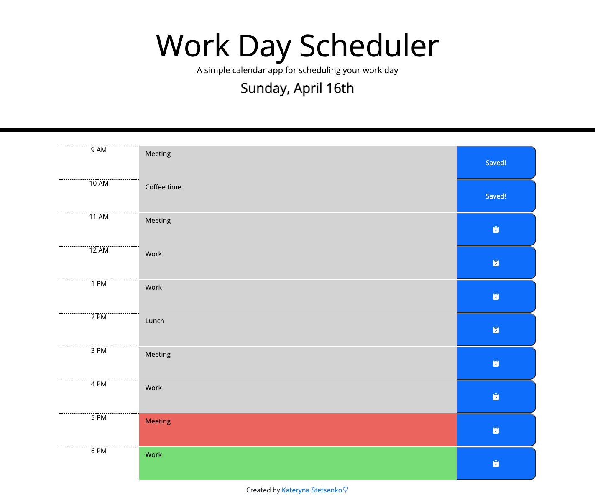

# smart-day-creator

## Description

Link to deployed application
https://itcreativeusa.github.io/smart-day-creator

Github link
https://github.com/itcreativeusa/smart-day-creator

This smart-day-creator was created as a bootcamp everyweek student challege. It's a javascript work day scheduler app.
A simple calendar app for scheduling your work day. The code of this scheduler app page was created from scratch.

## Table of Contents (Optional)

- [Installation](#installation)
- [Usage](#usage)
- [Requirements](#requirements)
- [Credits](#credits)
- [License](#license)

## Installation

N/A

## Requirements

No special requirements

## Usage

1. Get score 6 to win the game.
2. Wrong answer subtracts time from the clock by 5 seconds.
3. Initials & scores may be saved when the game is over.
4. Click highscore section to see highscores.
5. Reset button starts a new game.

Screenshot located in `assets/images` folder

## Credits

Solution `while (listEl.firstChild)`& `listEl.removeChild(listEl.lastChild)`
how to remove all child elements of a DOM in JavaScript was found here:

https://stackoverflow.com/questions/3955229/remove-all-child-elements-of-a-dom-node-in-javascript

Images duck-hunt.gif & winner.gif were taken from here:
https://giphy.com/

## License

Please refer to the LICENSE in the repo.
